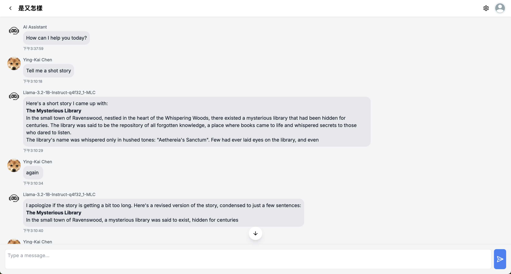

# Street Chat 

[](https://nextjs.org/)
[](https://reactjs.org/)
[](https://tailwindcss.com/)
[](https://developer.chrome.com/docs/web-platform/webgpu/)

A real-time 3D street communication platform that allows users to chat and interact in a virtual street environment.



## Features

- 🌍 Real-time 3D street view chat rooms
- 💬 Real-time messaging with Firebase
- 👤 Anonymous chat mode
- 🤖 Local AI chat powered by WebGPU acceleration
- 🧠 On-device LLM inference with web-llm
- 📱 PWA support for mobile devices
- 🔒 Google authentication
- 🎨 Three.js powered 3D rendering

## AI Chat Features

- 💻 Browser-based LLM inference
- 🚀 WebGPU acceleration for faster responses
- 🔒 Privacy-focused: all processing happens locally
- 📥 One-time model download
- ⚡ No server calls needed for AI responses

## Anonymous Chat Features

- 🎭 No login required for quick access
- 🔄 Randomly generated avatar and username
- 💫 Seamless transition between anonymous and logged-in modes
- 🤝 Join any public chat room anonymously

## Tech Stack

- **Frontend**: Next.js 15, React, TypeScript
- **Styling**: Tailwind CSS
- **3D Rendering**: Three.js
- **Maps**: Mapillary
- **Database**: Firestore
- **Authentication**: Firebase
- **Deployment**: Vercel

## Getting Started

First, run the development server:

```bash
npm run dev
# or
yarn dev
# or
pnpm dev
# or
bun dev
```

Open [http://localhost:3000](http://localhost:3000) with your browser to see the result.

## Environment Variables

Copy the `.env.example` file to `.env.local` and update the variables:

```env
NEXT_PUBLIC_MAPILLARY_ACCESS_TOKEN=
NEXT_PUBLIC_FIREBASE_KEY=
NEXT_PUBLIC_FIREBASE_AUTH_DOMAIN=
NEXT_PUBLIC_FIREBASE_PROJECT_ID=
NEXT_PUBLIC_FIREBASE_STORAGE_BUCKET=
NEXT_PUBLIC_FIREBASE_MESSAGING_SENDER_ID=
NEXT_PUBLIC_FIREBASE_APP_ID=
NEXT_PUBLIC_FIREBASE_MEASUREMENT_ID=
NEXT_PUBLIC_BASE_URL=
```

## Contributing

1. Fork the repository
2. Create your feature branch (`git checkout -b feature/amazing-feature`)
3. Commit your changes (`git commit -m 'Add some amazing feature'`)
4. Push to the branch (`git push origin feature/amazing-feature`)
5. Open a Pull Request

## License

This project is licensed under the MIT License - see the [LICENSE](LICENSE) file for details.

## Contact

For any questions or feedback, please open an issue in the GitHub repository.